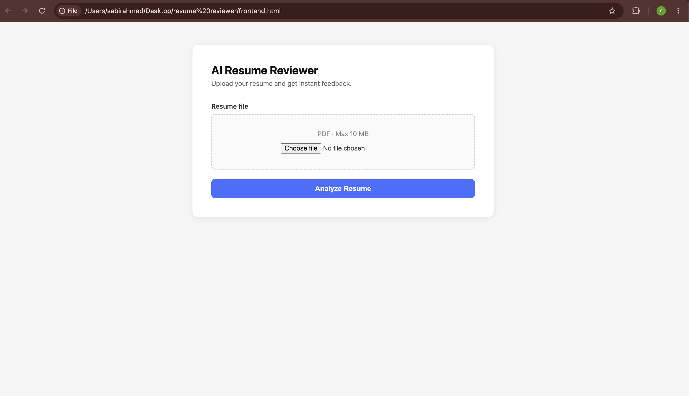
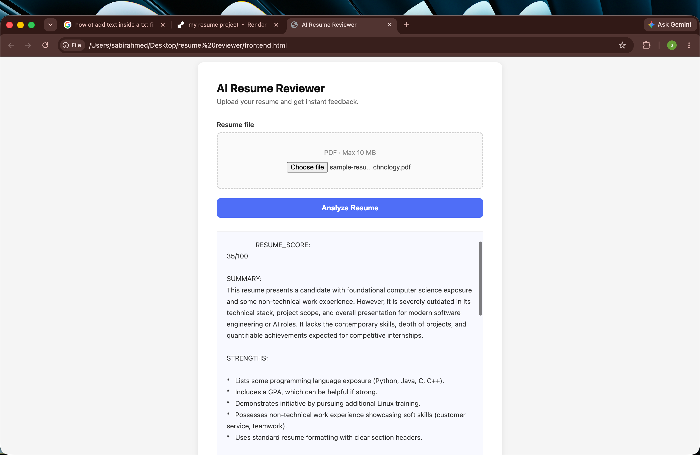

AI Resume Reviewer

AI-powered resume analysis tool built with Flask, Gemini API, and PyMuPDF.

Features

* Upload PDF resumes
* Resume scoring
* ATS analysis
* Strengths and weaknesses review
* Technical skills analysis
* Actionable improvement suggestions

Screenshots

Home Page

Resume Analysis

Tech Stack

* Python
* Flask
* Gemini API
* PyMuPDF
* HTML
* CSS
* JavaScript
* Gunicorn

Run Locally

Install dependencies:

pip install -r requirements.txt

Start backend:

python3 backend.py

Open frontend.html in your browser.

Edge Cases Handled

* No file uploaded
* Invalid PDF
* Empty PDF
* More than 5 pages
* Gemini API failure

Author

Sabir Ahmed